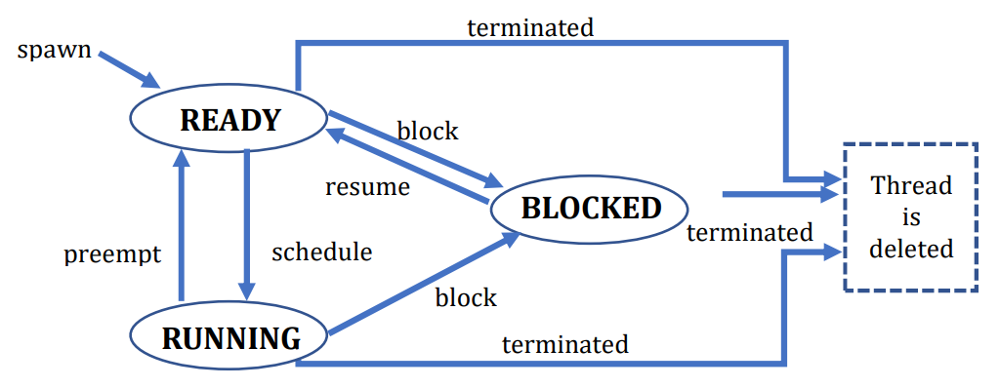

# UThreads - User-Level Threads Library

This project implements a user-level threads library (`uthreads`), developed as part of the Operating Systems course at the Hebrew University. It provides preemptive scheduling using Round-Robin and virtual timers, managing up to 100 threads with support for spawning, blocking, resuming, sleeping, and terminating threads.

---

## Overview

- Preemptive scheduling with configurable time quantums (via `SIGVTALRM`).  
- Thread states : `RUNNING`, `READY`, `BLOCKED`, and `SLEEPING`.  
- Uses a queue for ready threads, efficient ID tracking, and context switches based on `sigsetjmp/siglongjmp`.

<p align="center">
  
</p>


## Key Functions

Defined in [uthreads.h](uthreads.h) :  
- `uthread_init`: Initialize with a specified quantum length.  
- `uthread_spawn`: Create a new thread.  
- `uthread_terminate`: Terminate a specific thread.  
- `uthread_block`: Block a thread until resumed.  
- `uthread_resume`: Resume a previously blocked thread.  
- `uthread_sleep`: Sleep the current thread for a given number of quantums.  
- `uthread_get_tid`: Get the calling thread’s ID.  
- `uthread_get_total_quantums`: Total quantums since init.  
- `uthread_get_quantums`: Return how many quantums a thread has executed.

---

## File Structure

- **uthreads.cpp**: Implements scheduling, state management, and the library’s core logic.  
- **uthreads.h**: Public API containing function declarations and constants (e.g., `MAX_THREAD_NUM`, `STACK_SIZE`).  
- **Makefile**: Used to compile and archive the static library (libuthreads.a).

---

## Usage:

- in order to Compile, use the provided Makefile and run:
   ```bash
   make
   ```  
